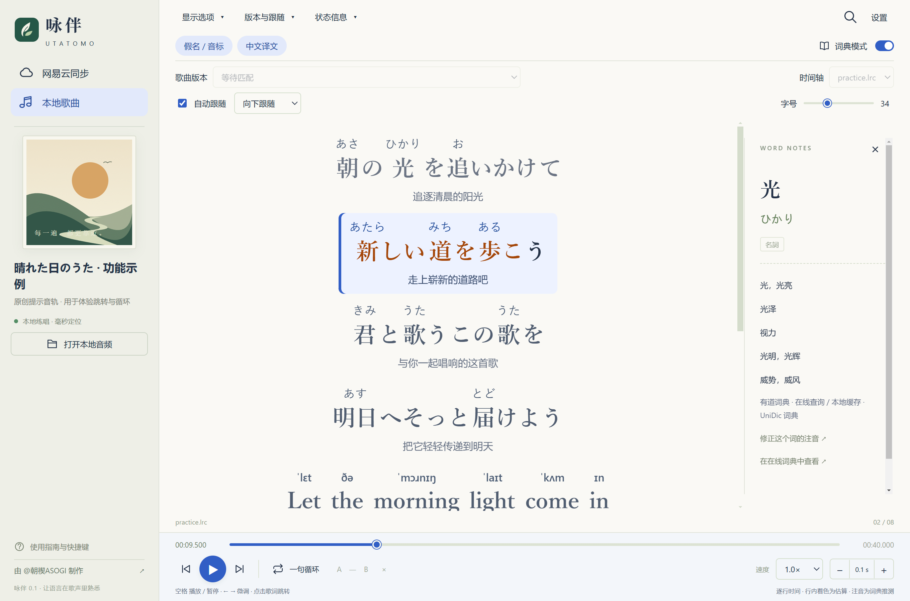
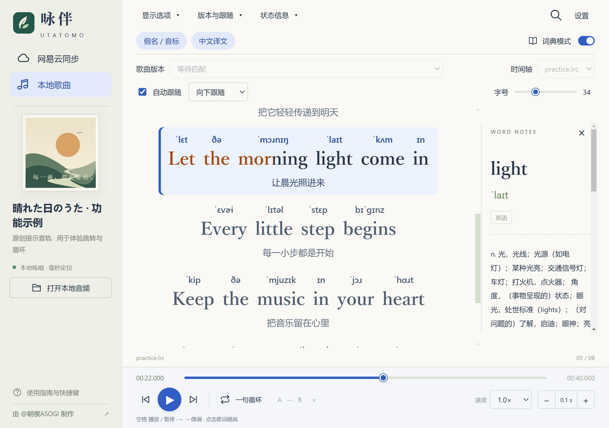

# 咏伴 · Utatomo

Windows 日语、英语歌词跟唱工具。可以跟随网易云音乐显示歌词，也可以打开本地音频练唱；原文、日语假名或英语音标、中文译文在同一窗口显示。

作者：[朝禊ASOGI](https://space.bilibili.com/315312) · [AsaMisogi](https://github.com/AsaMisogi)

## 下载与启动

1. 在 [Releases](https://github.com/AsaMisogi/Cloudmusic-Lyrics-Singing/releases/latest) 下载 `Utatomo-0.1.0-windows-x64.zip`。
2. 完整解压到有写入权限的文件夹，例如 `D:\Utatomo`。不要在压缩包内直接运行。
3. 双击 `Utatomo.exe`。便携版包含 Python、Qt 与离线注音词典，无需另行安装 Python。

适用于 Windows 10 / 11 x64，窗口最小尺寸为 960 × 700。启动时会同时打开日志窗口和歌词窗口；关闭歌词窗口会退出程序。`_internal` 是程序依赖目录，请保留完整文件夹。

想先了解操作，可以点击空白页的「体验示例」。示例由原创日英句子和提示音轨组成，不是真人演唱。

## 功能

- 识别网易云当前歌曲，获取原文和中文译文；支持搜索歌名、歌曲 ID 或链接，以及切换歌词版本。
- 日语假名、英语美式 IPA 注音；可以针对当前歌曲中某个词的位置修正读音。
- 点击歌词跳转播放，单句循环、A/B 循环、歌词偏移和进度微调。
- 本地音频支持 0.5–1.5 倍速；客户端同步模式支持播放、暂停和双向进度控制。
- 点击词汇查询日汉或英汉释义；缺少中文译文时可手动补充机译。
- 调整字号、隐藏注音或译文、切换歌词跟随方式，自动保存显示偏好。

## 界面示例

以下为程序实际运行截图，使用随包提供的原创示例。

日语注音、中文译文与查词：



英语音标与紧凑窗口：



## 跟随网易云音乐

普通启动后，程序会通过 Windows 媒体接口识别网易云当前歌曲。要使用双向进度控制：

1. 在网易云系统托盘菜单中完整退出客户端。只关窗口可能仍在后台运行。
2. 在咏伴点击「连接客户端」，由工具启动网易云。
3. 在网易云播放歌曲，等状态显示「客户端直连 · 双向同步」。
4. 使用播放按钮、进度条、点击歌词或循环功能练唱。

声音由网易云客户端播放。切换歌词版本不会更换音频，VIP 和网盘曲目的播放仍取决于客户端自身权限。此模式暂不支持变速，循环最短为 0.8 秒；进度精度受客户端回传限制，可能有数百毫秒误差。

已在网易云 Windows 版 3.1.41.205529 验证客户端直连。其他版本可能因接口变化而无法连接，此时会退回 Windows 媒体接口，部分进度控制不可用。连接使用本机 `127.0.0.1:9222` 调试端口，不修改网易云安装文件；完整退出网易云后端口关闭，恢复普通启动方式即可停止使用直连。

## 打开本地歌曲

点击「打开本地音频」，选择 MP3、FLAC、WAV、M4A、OGG、OPUS、AAC 或 WMA。格式是否能播放取决于 Qt 解码器，失败时会显示错误。

同目录下的同名歌词会自动加载，例如：

```text
我的歌曲.flac
我的歌曲.lrc
我的歌曲.zh.lrc
```

原文支持 `.yrc`、`.lrc`、`.txt`，译文也支持 `.trans.lrc`。可在右上角「···」手动导入歌词和译文，支持 UTF-8、UTF-16 和 GB18030 编码。没有时间标签的 TXT 可以阅读和查词，不能按歌词跳转。

## 常用操作

| 操作 | 按钮或快捷键 |
| --- | --- |
| 播放 / 暂停 | 空格 |
| 跳到某句并播放 | 点击歌词；可在设置中关闭自动播放 |
| 词典模式下跳转 | Shift + 点击歌词 |
| 上一句 / 下一句 | ↑ / ↓ |
| 前后微调 0.1 秒 | ← / → |
| 前后微调 0.01 秒 | Shift + ← / →，适用于本地模式 |
| 单句循环 | L 或「一句循环」 |
| 设置 A / B 点 | `[` / `]`，点击 × 清除 |
| 歌词时间偏移 | 「···」→ 时间偏移；正数让歌词延后 |
| 调整字号 | 顶部字号滑块 |
| 恢复歌词跟随 | 「回到当前歌词」 |

浏览其他歌词时默认停留在当前位置，设置中可启用 4 秒后自动返回。本地循环最短为 0.1 秒，Qt 支持时变速保留音高。

## 注音与歌词说明

日语优先使用用户修正、歌曲读音勘误、原文注音和可对齐的歌曲罗马音，缺少资料时使用本地词典。来源存在分歧时会标记，特殊唱法可能与自动读音不同；在词典模式中点击词汇，可选择「修正这个词的注音」。英语使用 CMU 发音词库，未收录的词不生成音标。

优先选用完整且有真实逐字时间的歌词；逐字版明显残缺时使用逐行版，也可手动切换。普通 LRC 的行内高亮是估算，YRC / 增强 LRC 使用已有逐字时间。歌词时间异常时会核对相同版本的候选，原时间轴仍保留。

中文译文优先使用网易云或本地文件。「补充中文机译」使用 Google 翻译，不可用时尝试 MyMemory，结果会标注为机译。注音、自动匹配和翻译都可能出错，可自行选择歌词版本或导入文件修正。

## 本地数据与联网

便携版在 `Utatomo.exe` 所在目录保存 `data/` 和 `.cache/`；源码版保存在项目目录。

| 位置 | 内容 |
| --- | --- |
| `data/cache/` | 歌词、封面、词义、机译和练唱音频缓存 |
| `data/song-overrides.json` | 按歌曲与位置保存的注音修正 |
| `data/overrides.json` | 兼容旧版的全局注音修正 |
| `data/webview/` | 字号、显示开关等偏好 |
| `data/logs/utatomo.log` | 运行与错误日志 |

歌曲搜索、歌词与封面从网易云获取；词典查询使用有道，补充机译使用 Google / MyMemory。首次请求需要联网，已缓存的部分内容可离线使用，工具不上传音频文件。退出程序后删除 `data/cache/` 可清理内容缓存；更新时保留 `data/` 可保留个人数据。

## 从源码运行与打包

双击 `启动.bat` 或 `start.bat`。首次运行会联网安装项目私有的 Python 3.12 和锁定依赖，后续直接启动。

```powershell
# 安装锁定依赖
powershell -NoProfile -ExecutionPolicy Bypass -File scripts/bootstrap.ps1

# 启动
.venv/Scripts/python.exe main.py

# 单元测试与真实窗口验收
.venv/Scripts/python.exe -m unittest discover -s tests -v
.venv/Scripts/python.exe main.py --smoke-test
.venv/Scripts/python.exe scripts/verify_ui.py

# 构建 Windows x64 便携包及 SHA256 校验文件
.venv/Scripts/python.exe scripts/build_release.py
```

打包需要 Windows x64，产物位于 `dist/`。源码采用 [GPLv3](LICENSE)；第三方组件保留各自许可证，便携包附带 `THIRD-PARTY-LICENSES/`。歌曲、歌词与在线服务内容归各自权利人。

更多资料：[架构说明](docs/architecture.md) · [第三方来源](docs/third-party.md) · [验收记录](docs/verification.md)
