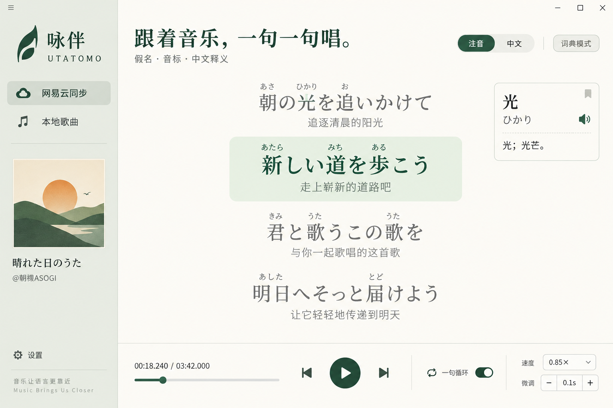

# 界面设计

名称：**咏伴 · Utatomo**。图标将叶片与上扬的音符轮廓组合，表达陪伴练唱；署名为 **@朝禊ASOGI**，点击打开作者 B 站空间。

## 设计稿与实现

在编写前端前，使用 **内置 imagegen 工具**生成了 `assets/design-mockup.png`。前端以此为依据实现，未使用 CLI 或外部 API 生图。

设计稿：



- 米白 `#faf9f5` 为阅读背景，浅灰绿 `#eeefe7` 为侧栏，蓝色 `#315ec5` 标识主要操作和当前行。
- 左侧只保留来源、当前曲目信息、打开音频及作者信息。
- 原文使用日文衬线字体；假名为正文的 52%、英语 IPA 为 48%，深色、中等字重，当前行注音进一步加深。中文译文位于独立一行。
- 当前行采用浅蓝背景和左侧蓝色标记；已唱字词为琥珀色 `#a44708`，未唱正文深灰，历史行中灰。歌词行不显示序号或「第几句」文字。
- 歌曲版本、歌词时间轴、20–64 px 字号、自动跟随开关和模式常驻主界面。词典按需展开；导入、补译与偏移放在次级工具面板。
- 自动跟随默认开启，提供「向下跟随」与「当前句居中」；滚轮临时浏览后 4 秒恢复，关闭勾选后持续自由浏览。居中模式首尾留出足够空间。
- 底部固定毫秒进度条和练唱操作，不随歌词滚动。
- 键盘焦点可见；布局针对 960 × 700 及更大窗口适配；尊重减少动画偏好。

最初设计稿保留作历史参考；当前实现以本节文字规范为准，加入了「连接客户端」和真实同步状态提示。

## 实际使用的生图提示词

```text
Use case: ui-mockup. Design a polished Windows desktop Japanese and English song learning application named 咏伴 UTATOMO. Wide 1536x1024 front-on app screenshot, no device frame. Warm ivory canvas, deep forest green accent, restrained orange current lyric progress, precise typography. Slim left sidebar 220px with abstract musical leaf monogram, app title 咏伴, navigation 网易云同步 and 本地歌曲, an elegant minimal album art square (abstract sun over rolling green hills), song metadata 晴れた日のうた, small author @朝禊ASOGI. Main large panel with top heading 跟着音乐，一句一句唱。, subtitle 假名 · 音标 · 中文释义, small toggles 注音 中文 词典模式. Middle roomy 4 lines of Japanese lyrics using original sample text: 朝の光を追いかけて / 新しい道を歩こう / 君と歌うこの歌を / 明日へそっと届けよう. Tiny hiragana ruby above kanji and smaller Chinese translation below each line. Current line in forest green with pale green rounded highlight, previous and next lines muted. Right small compact dictionary card 光 ひかり 光；光芒. Bottom player panel timestamp 00:18.240 / 03:42.000, thin fine seeking slider with green thumb, previous play next buttons, single line repeat 一句循环, speed 0.85×, fine adjustment ±0.1s. Lots of whitespace, simple beautiful professional desktop utility, subtle borders, no gradients on main UI, realistic implementable frontend design.
```
